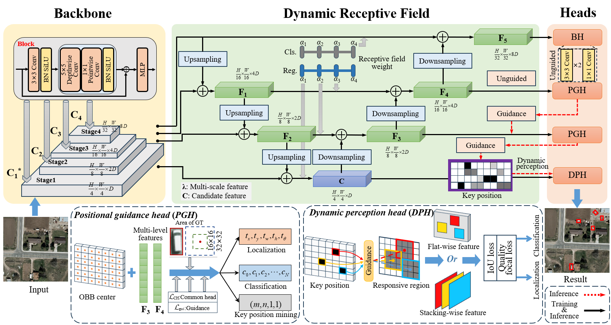

# Position Guided Dynamic Receptive Field Network: A Small Object Detection Friendly to Optical and SAR Images

This repository is the official implementation of "Position Guided Dynamic Receptive Field Network: A Small Object Detection Friendly to Optical and SAR Images" .



## Introduction

This repository is the official implementation of "Position Guided Dynamic Receptive Field Network: A Small Object Detection Friendly to Optical and SAR Images" at [Please stay tuned!]

The master branch is built on MMRotate which works with **PyTorch 1.8+**.

PG-DRFNet's train/test configure files are placed under configs/PG-DRFNet/

How to utilize the dynamic perception of PG-DRFNet can be referenced to [here](docs/en/tutorials/dynamic_perception.md).

## Deep Learning Experiments

### Source of Pre-trained models

* CSPNeXt-m: pre-trained checkpoint supported by Openmmlab([link](https://download.openmmlab.com/mmdetection/v3.0/rtmdet/cspnext_rsb_pretrain/cspnext-m_8xb256-rsb-a1-600e_in1k-ecb3bbd9.pth)).
* ResNet: pre-trained ResNet50 supported by Pytorch.

### Results and models

|                    Model                     | Datasets |  mAP  | Angle | lr schd | Batch Size |                           Configs                            |                           Download                           |
| :------------------------------------------: | -------- | :---: | :---: | :-----: | :--------: | :----------------------------------------------------------: | :----------------------------------------------------------: |
| [RTMDet-M](https://arxiv.org/abs/2212.07784) | DOTA2.0  | 57.71 | le90  |   6x    |     8      |                              -                               |                              -                               |
|                  PG-DRFNet                   | DOTA2.0  | 59.01 | le90  |   6x    |     8      | [pg_drfnet-6x-dota2](./configs/PG-DRFNet/DOTA2_0/pg_drfnet-6x-dota2.py) | [model](https://drive.google.com/file/d/17ARF2Dv__Fl94EOWFnH4w9ZeBtJ_dJkY/view?usp=drive_link) \| [log](./tools/work_dirs/PG-DRFNet/20231017_003441.log) |

For example, when dataset is DOTA2.0 and method is PG-DRFNet, you can train by running the following

```bash
python tools/train.py \
  --config configs/PG-DRFNet/pg_drfnet-6x-dota2.py \
  --work-dir work_dirs/PG-DRFNet \
  --load_from path/to/pre-trained/model \
```

and if you want submit the DOTA2.0 results for online evaluation, you can run  as follows

```bash
python tools/test.py \
  --config configs/PG-DRFNet/pg_drfnet-6x-dota2.py \
  --checkpoint path/to/gvt/model \
  --cfg-options test_dataloader.dataset.ann_file=''  test_dataloader.dataset.data_prefix.img_path=test/images/ test_evaluator.format_only=True test_evaluator.merge_patches=True test_evaluator.outfile_prefix='path/to/save_dir'
```

### Hyperparameters Configuration

Detailed hyperparameters config can be found in configs/base/

## Installation

[MMRotate](https://github.com/open-mmlab/mmrotate/tree/1.x) depends on [PyTorch](https://pytorch.org/), [MMCV](https://github.com/open-mmlab/mmcv) and [MMDetection](https://github.com/open-mmlab/mmdetection).
Below are quick steps for installation.
Please refer to [Install Guide](https://mmrotate.readthedocs.io/en/latest/install.html) for more detailed instruction.

```shell
conda create --name openmmlab python=3.8 -y
conda activate openmmlab
conda install pytorch==1.8.0 torchvision==0.9.0 cudatoolkit=10.2 -c pytorch
pip install -U openmim
mim install mmcv-full
mim install mmdet
git clone https://github.com/Qian-CV/PG-DRFNet.git
cd PG-DRFNet
pip install -v -e .
```

## Get Started

Please see [here](docs/en/get_started.md) for the basic usage of MMRotate.
We also provide some tutorials for:

- [learn the basics](docs/en/intro.md)
- [learn the config](docs/en/tutorials/customize_config.md)
- [customize dataset](docs/en/tutorials/customize_dataset.md)
- [customize model](docs/en/tutorials/customize_models.md)
- [dynamic perception](docs/en/tutorials/dynamic_perception.md)
- [useful tools](docs/en/tutorials/useful_tools.md)

## Acknowledgments

The code is developed based on the following repositories. We appreciate their nice implementations.

|  Method  |                Repository                 |
| :------: | :---------------------------------------: |
|  RTMDet  | https://github.com/open-mmlab/mmdetection |
| RTMDet-R |  https://github.com/open-mmlab/mmrotate   |
|  ECANet  |    https://github.com/BangguWu/ECANet     |
|  QFocal  |     https://github.com/implus/GFocal      |

## Cite this repository

If you use this software in your work, please cite it using the following metadata. Liuqian Wang, Jing Zhang, et. al. (2024). PG-DRFNet by BJUT-AI&VBD [Computer software]. https://github.com/Qian-CV/PG-DRFNet